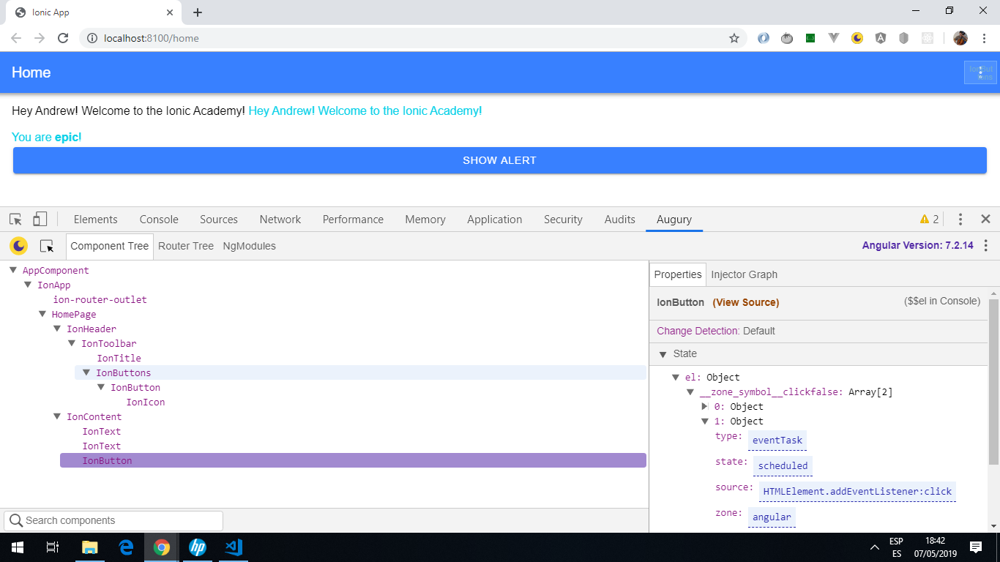
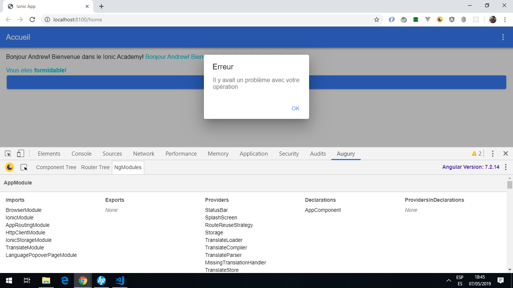

# Ionic Angular Localiser

This project uses [ngx translate, the internationalisation (i18n) library for Angular](http://www.ngx-translate.com) to change the content of the home page and alert button to the language chosen.

*** Note: to open web links in a new window use: _ctrl+click on link_**

## Table of contents

* [General info](#general-info)
* [Screenshots](#screenshots)
* [Technologies](#technologies)
* [Setup](#setup)
* [Features](#features)
* [Status](#status)
* [Inspiration](#inspiration)
* [Contact](#contact)

## General info

"The [ngx-translate, the internationalisation (i18n) library for Angular](http://www.ngx-translate.com) lets you define translations for your content in different languages and switch between them easily. Check out the demo on StackBlitz.

It allows access to a service, a directive and a pipe to handle any dynamic or static content. The main part of the library the 'core'. A loader was added to load translations into the app.

## Screenshots





## Technologies

* [Ionic framework v5.7.0](https://ionicframework.com/)

* [Angular CLI v8.0.1](https://github.com/angular/angular-cli)

* [Angular framework v8.0.0](https://angular.io/)

* [ngx translate/core (i18n) library v11.0.1](http://www.ngx-translate.com)

* [Angular Augery Chrome Extension v1.2.11](https://augury.rangle.io/) useful for debugging.

## Setup

* Run `ng serve` for a dev server. Navigate to `http://localhost:4200/`. The app will automatically reload if you change any of the source files.

## Code Examples

* `language.service.ts` function to set app language using option selected by user.

```typescript
// sets default language as browser language if no other language choice made
// if language language selected then this value is stored using the ionic storage module
setInitialAppLanguage() {
  const language = this.translate.getBrowserLang();
  this.translate.setDefaultLang('en');

  this.storage.get(LNG_KEY).then(val => {
    if (val) {
      this.setLanguage(val);
      this.selected = val;
    }
  });
}

```

## Features

* Select a language from the drop-down list and the language of headers, buttons, text alerts alerts (as set up in the `/assets/i18n/json` files will change.

## Status & To-Do List

* Status: Working app that shows off the [ngx-translate, the internationalisation (i18n) library for angular](http://www.ngx-translate.com) module.

* To-Do: add functionality. Use in another app to provide language translation.

## Inspiration

* [Ionic Academy: How to Localise Your Ionic App with ngx-translate](https://ionicacademy.com/localise-ionic-ngx-translate/).

## Contact

Repo created by [ABateman](https://www.andrewbateman.org) - feel free to contact me!
